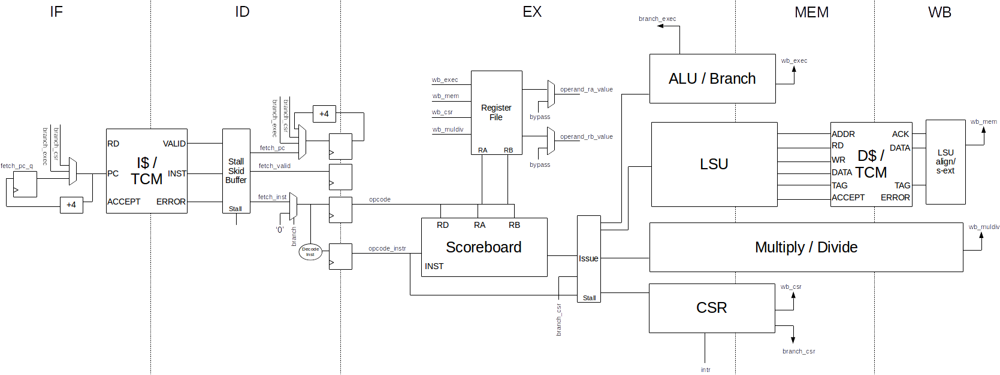
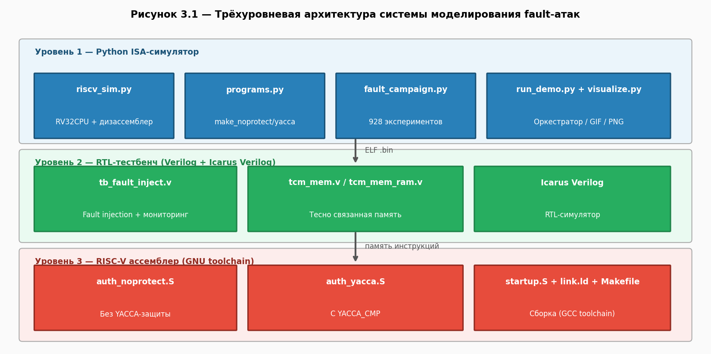
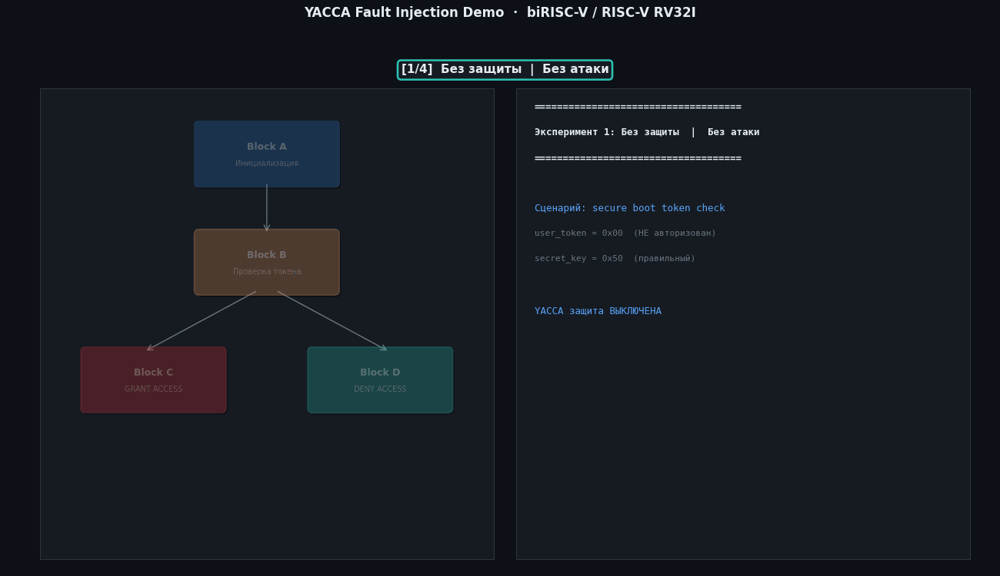
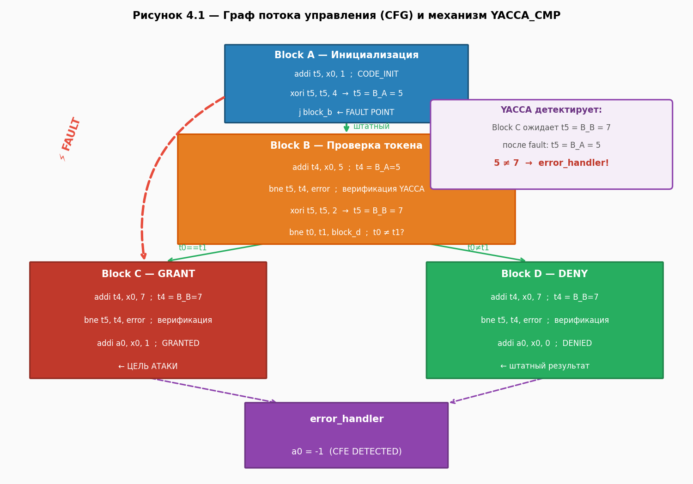
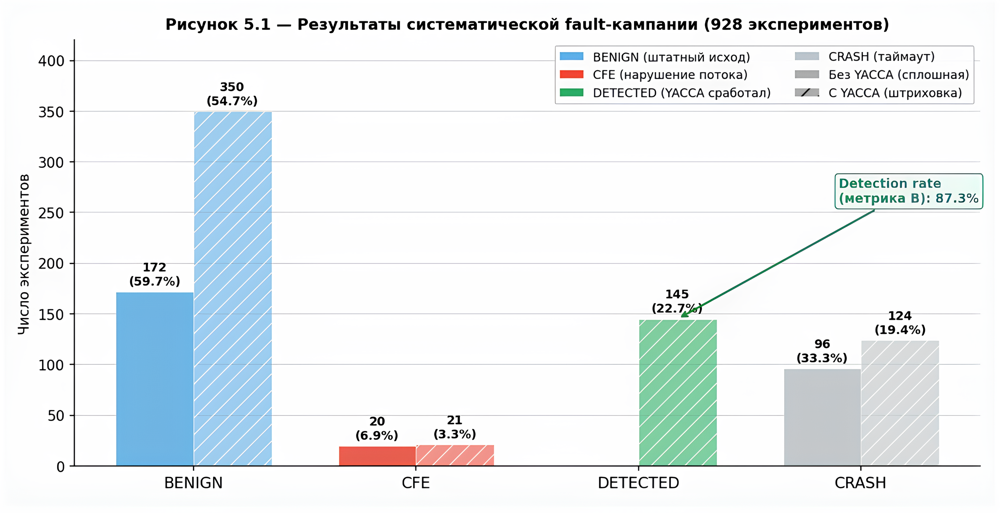
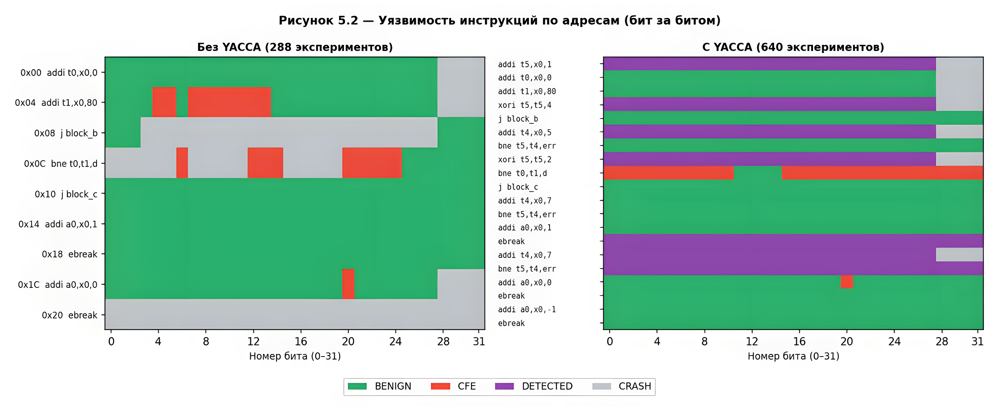

# Разработка системы моделирования fault-атак на процессорное ядро RISC-V для анализа устойчивости к инъекции ошибок

**Автор:** Рыбалка Иван Петрович  
**Группа:** МКБ-241  
**Научный руководитель:** Мещеряков Ярослав Евгеньевич, к.т.н., доцент  
**Университет:** НИУ ВШЭ (МИЭМ им. А.Н. Тихонова)  
**Программа:** Магистратура «Кибербезопасность»  
**Год:** 2026

---

## Аннотация

**Цель работы** — разработка программного симулятора для моделирования fault-атак (атак с инъекцией ошибок) на процессорное ядро biRISC-V с целью оценки его устойчивости к аппаратным воздействиям.

**Актуальность** обусловлена растущим распространением архитектуры RISC-V благодаря инвестициям крупных компаний и её активному использованию в научной среде. Открытый исходный код, простота реализации и наследование лучших практик RISC-архитектур делают RISC-V перспективной, но и потенциально уязвимой платформой. Количество уязвимостей в современных процессорах продолжает расти, особенно в открытых архитектурах, что требует создания инструментов для анализа и повышения их устойчивости к аппаратным атакам.

**Научная новизна** заключается в создании специализированного симулятора, позволяющего детально изучать воздействие fault-атак на микроархитектурном уровне, что ранее не было полноценно реализовано для открытых RISC-V решений.

**Практическая значимость** состоит в возможности использования симулятора для:
1.  образовательных целей (демонстрация механизмов атак и защиты);
2.  исследовательской работы (анализ уязвимостей и тестирование контрмер);
3.  разработки защищённых процессорных ядер на этапе проектирования.

**Структура работы:** 85 страниц, включает *N* рисунков, *N* таблиц, *N* источников, *N* приложений.

---

## Abstract

**Aim:** Development of a software simulator for modeling fault attacks on the biRISC-V processor core to assess its resilience to hardware impacts.

**Relevance:** Driven by the growing adoption of the RISC-V architecture due to investments from major companies and its active use in the scientific community. The open-source nature, simplicity, and inheritance of best practices from RISC architectures make RISC-V a promising yet potentially vulnerable platform. The number of vulnerabilities in modern processors continues to increase, particularly in open architectures, necessitating tools for analyzing and enhancing their resilience to hardware attacks.

**Novelty:** Creation of a specialized simulator enabling detailed study of fault attack effects at the microarchitectural level, which has not been fully implemented for open RISC-V solutions previously.

**Practical Significance:** The simulator can be used for: 1) educational purposes (demonstrating attack and defense mechanisms); 2) research work (vulnerability analysis and testing countermeasures); 3) development of secure processor cores at the design stage.

**Structure:** 85 pages, includes *N* figures, *N* tables, *N* references, *N* appendices.

---

## Задание на выполнение ВКР

**Студент:** Рыбалка Иван Петрович, группа МКБ-241

**1. Тема работы**
Разработка системы моделирования fault-атак на процессорное ядро RISC-V для анализа устойчивости к инъекции ошибок

**2. Требования к работе**

- **2.1. Цель работы:** Разработка и реализация системы моделирования fault-атак для процессорного ядра biRISC-V с последующей оценкой эффективности защитных механизмов на основе методологии YACCA.
- **2.2. Требования к результатам работы:**
    - 2.2.1. Изучить методы fault-атак: исследовать современные техники инъекции ошибок (сбои тактирования, питания, электромагнитное воздействие).
    - 2.2.2. Модифицировать RTL-модель biRISC-V: внедрить механизмы принудительной инъекции ошибок в различные компоненты процессора.
    - 2.2.3. Разработать систему тестирования: создать автоматизированные сценарии атак и анализа последствий.
    - 2.2.4. Провести эксперименты: оценить уязвимости процессора и эффективность различных типов атак.
- **2.3. Требования к документации:** Текст ВКР должен быть оформлен в соответствии с ГОСТ.

**3. Содержание работы**
1.  Провести анализ современных методов fault-атак и существующих решений для моделирования инъекции ошибок.
2.  Реализовать систему автоматизированного тестирования с поддержкой различных сценариев атак.
3.  Адаптировать методологию YACCA для защиты процессора biRISC-V.
4.  Оценить эффективность защитных механизмов и разработать рекомендации по проектированию устойчивых систем.
5.  Демонстрация полученных результатов.
6.  Подготовка пояснительной записки к ВКР.

**4. Сроки выполнения этапов работы**

| Этап | Срок |
| :--- | :--- |
| Проект ВКР | до «15» февраля 2026 г. |
| Первый вариант ВКР | до «31» марта 2026 г. |
| Итоговый вариант ВКР (до загрузки в «Антиплагиат») | до «30» апреля 2026 г. |

**Подписи:**

| | Дата | Подпись |
| :--- | :--- | :--- |
| **Задание выдал** | «20» декабря 2025 г. | \_\_\_\_\_\_\_\_\_\_\_\_ (Я.Е. Мещеряков) |
| **Задание принял** | «20» декабря 2025 г. | \_\_\_\_\_\_\_\_\_\_\_ (И.П. Рыбалка) |

---

## Содержание

- [1 Введение](#1-введение)
    - [1.1 Актуальность и проблемная область](#11-актуальность-и-проблемная-область)
    - [1.2 Уязвимость архитектуры RISC-V: открытость как новая поверхность атаки](#12-уязвимость-архитектуры-risc-v-открытость-как-новая-поверхность-атаки)
    - [1.3 Эволюция fault-атак: от теории к практике на RISC-V](#13-эволюция-fault-атак-от-теории-к-практике-на-risc-v)
    - [1.4 Конкретные уязвимости 2026 года: микроархитектурные ловушки](#14-конкретные-уязвимости-2026-года-микроархитектурные-ловушки)
    - [1.5 Ошибки потока управления как критическое последствие fault-атак](#15-ошибки-потока-управления-как-критическое-последствие-fault-атак)
    - [1.6 Проблема моделирования и анализа](#16-проблема-моделирования-и-анализа)
    - [1.7 Программные контрмеры и проблема их выбора](#17-программные-контрмеры-и-проблема-их-выбора)
    - [1.8 Итоговая формулировка проблемы и цель работы](#18-итоговая-формулировка-проблемы-и-цель-работы)
- [2 Анализ проблемы и существующих решений](#2-анализ-проблемы-и-существующих-решений)
    - [2.1 Кибербезопасность встроенных систем и аппаратные уязвимости](#21-кибербезопасность-встроенных-систем-и-аппаратные-уязвимости)
    - [2.2 Классификация fault-атак и физических воздействий](#22-классификация-fault-атак-и-физических-воздействий)
    - [2.3 Архитектура RISC-V и процессорного ядра biRISC-V](#23-архитектура-risc-v-и-процессорного-ядра-birisc-v)
    - [2.4 Обзор существующих методов моделирования fault-атак](#24-обзор-существующих-методов-моделирования-fault-атак)
    - [2.5 Системы защиты от fault-атак: подходы и ограничения](#25-системы-защиты-от-fault-атак-подходы-и-ограничения)
    - [2.6 Выводы по обзору и постановка задачи исследования](#26-выводы-по-обзору-и-постановка-задачи-исследования)
- [3 Архитектура системы моделирования fault-атак](#3-архитектура-системы-моделирования-fault-атак)
    - [3.1 Общая архитектура системы](#31-общая-архитектура-системы)
    - [3.2 Модель инъекции ошибок и ее параметризация](#32-модель-инъекции-ошибок-и-ее-параметризация)
    - [3.3 Интеграция с RTL-моделью biRISC-V](#33-интеграция-с-rtl-моделью-birisc-v)
    - [3.4 Система управления экспериментом](#34-система-управления-экспериментом)
    - [3.5 Механизмы сбора и анализа данных](#35-механизмы-сбора-и-анализа-данных)
    - [3.6 Производительность и масштабируемость решения](#36-производительность-и-масштабируемость-решения)
- [4 Реализация системы моделирования](#4-реализация-системы-моделирования)
    - [4.1 Модификация процессорного ядра biRISC-V](#41-модификация-процессорного-ядра-birisc-v)
    - [4.2 Реализация механизмов инъекции ошибок](#42-реализация-механизмов-инъекции-ошибок)
    - [4.3 Система автоматизированного тестирования](#43-система-автоматизированного-тестирования)
    - [4.4 Интеграция с симуляторами Verilator и Icarus Verilog](#44-интеграция-с-симуляторами-verilator-и-icarus-verilog)
    - [4.5 Реализация защитных механизмов YACCA](#45-реализация-защитных-механизмов-yacca)
    - [4.6 Оптимизация производительности системы](#46-оптимизация-производительности-системы)
- [5 Систематическое fault-исследование](#5-систематическое-fault-исследование) 
    - [5.1 Сводные результаты исследования](#51-сводные-результаты-исследования)
    - [5.2 Тепловая карта уязвимостей по инструкциям](#52-тепловая-карта-уязвимостей-по-инструкциям)
    - [5.3 Результаты исследования ](#53-результаты-исследования)
- [6 Заключение](#6-заключение)
- [7 Список использованных источников](#7-список-использованных-источников)
- [ПРИЛОЖЕНИЕ А. Основные требования к оформлению текста ВКР](#приложение-а-основные-требования-к-оформлению-текста-вкр)

---

## 1 Введение

Настоящая работа посвящена разработке системы моделирования fault-атак (атак с инъекцией ошибок) на процессорное ядро RISC-V для анализа его устойчивости, а также выбору и реализации программных контрмер, предназначенных для обнаружения возникающих нарушений. В качестве основы для реализации защитных механизмов рассматривается методология YACCA (Yet Another Control Flow Checking Approach), ориентированная на обнаружение ошибок потока управления.

### 1.1 Актуальность и проблемная область

Современные встроенные системы лежат в основе критической инфраструктуры: от автомобильной электроники до промышленных контроллеров и устройств Интернета вещей (IoT). Безопасность этих систем традиционно строится на предположении, что аппаратное обеспечение является «корнем доверия» (root of trust). Однако, как показывают последние исследования, это предположение всё чаще оказывается уязвимым местом. Аппаратные атаки, в частности fault-атаки (инъекции ошибок), позволяют злоумышленнику обходить программные механизмы защиты, воздействуя непосредственно на физическую среду выполнения кода.

### 1.2 Уязвимость архитектуры RISC-V: открытость как новая поверхность атаки

Архитектура RISC-V набирает популярность благодаря своей открытости, гибкости и инвестициям со стороны крупнейших игроков индустрии. Однако эта же открытость создает новые риски. В отличие от закрытых архитектур (x86, ARM), где многолетний опыт производства привел к формированию определенных систем безопасности «по умолчанию», экосистема RISC-V находится в стадии становления. Как было отмечено на конференции FOSDEM 2026 [1], производители RISC-V процессоров зачастую выбирают небезопасные конфигурации по умолчанию, поставляют недостаточно протестированные и проверенные расширения и пропускают механизмы ограничения спекулятивного выполнения. Это приводит к тому, что даже простые процессоры с последовательным выполнением инструкций (in-order) содержат архитектурные изъяны и мощные побочные каналы утечки информации. Недавнее исследование, представленное на FOSDEM 2026, подтверждает, что вопрос безопасности коммерческих RISC-V процессоров остается открытым, а такие ошибки, как GhostWrite в ядрах T-Head XuanTie C910, демонстрируют критический разрыв между спецификацией и реализацией [2].

### 1.3 Эволюция fault-атак: от теории к практике на RISC-V

Fault-атаки представляют собой класс физических воздействий, при которых злоумышленник вмешивается в работу процессора, чтобы вызвать временный сбой (глитч-эффект). Наиболее распространенными векторами являются:

- **Глитчи тактовой частоты (Clock Glitching):** Кратковременное изменение частоты тактового генератора для пропуска инструкций или искажения данных.
- **Глитчи питания (Voltage Glitching):** Броски напряжения, вызывающие нестабильность работы логических элементов.
- **Электромагнитное воздействие (EMFI):** Локальное наведение вихревых токов для переключения битов.

Последние исследования демонстрируют, что RISC-V системы, включая реализации доверенных сред исполнения (Trusted Execution Environments, TEE), уязвимы к таким атакам. Это позволяет атакующему не просто нарушить работу системы, но и поднять свои привилегии, извлечь криптографические ключи или модифицировать критически важные данные в памяти, обходя все программные механизмы защиты. Примечательно, что экосистема open-source инструментов для тестирования таких атак активно развивается: проекты lowRISC и NewAE предлагают доступные платформы для fault-инъекций и анализа побочных каналов, такие как ChipWhisperer и ChipShouter [3, 4].

### 1.4 Конкретные уязвимости 2026 года: микроархитектурные ловушки

Проблема усугубляется тем, что современные RISC-V ядра становятся сложнее, начиная наследовать проблемы x86 и ARM архитектур, связанные со спекулятивным выполнением (speculative execution) и оптимизацией производительности.

- **Расширение спектра уязвимостей:** в начале 2026 года в Linux ядро были внесены исправления для RISC-V, закрывающие векторы микроархитектурных атак, связанные со спекулятивным доступом к таблице системных вызовов (аналог Spectre-подобных атак). Это подтверждает, что RISC-V не обладает «врожденным» иммунитетом к классам уязвимостей, десятилетиями преследующим x86. Согласно отчету Phoronix от января 2026, Linux 6.19 получил важные исправления для RISC-V, предотвращающие спекулятивный доступ к таблице системных вызовов — еще один шаг в признании того, что RISC-V уязвим к микроархитектурным атакам [5].
- **Критические ошибки реализации (GhostWrite):** Инструменты автоматизированного поиска уязвимостей, такие как фаззинг-фреймворк RISCover, выявили в коммерческих RISC-V CPU (например, T-Head XuanTie C910) критические ошибки, позволяющие непривилегированному коду напрямую писать в физическую память, полностью обходя механизмы виртуализации. Такие ошибки, как GhostWrite, делают традиционные fault-атаки еще более опасными, так как снижают порог сложности для злоумышленника [6].
- **Отказ в обслуживании (Halt-and-Catch-Fire):** Недавно зарегистрированная уязвимость CVE-2026-23217 демонстрирует, что даже механизмы трассировки в RISC-V ядре Linux могут привести к взаимоблокировке (deadlock) системы, что подчеркивает важность верификации на всех уровнях [7, 8, 9].
- **Микроархитектурный шпионаж:** Исследователи из Telecom Paris показали, что даже механизмы предсказания переходов в RISC-V ядрах с внеочередным исполнением (out-of-order) могут быть использованы для извлечения секретной информации с высокой точностью, что открывает новые векторы атак на базе анализа времени выполнения [10].

### 1.5 Ошибки потока управления как критическое последствие fault-атак

Одним из наиболее опасных последствий fault-атак является возникновение ошибок потока управления (control flow errors). Ошибка потока управления представляет собой ошибочный переход в ходе выполнения программы, вызванный внешними воздействиями. Такие воздействия, как электромагнитные помехи или глитчи питания, могут приводить к инверсии битов (сбоям, bit-flips) в различных компонентах аппаратного обеспечения системы — от регистров до памяти инструкций. В свою очередь, эти сбои нарушают порядок выполнения инструкций. Данное явление может привести к зависанию программы или её аварийному завершению, что потенциально создает опасные ситуации, особенно в системах критического применения. Вызванная инверсия бита также может проявиться как ошибка потока данных, повреждая информацию, необходимую программе, однако данный класс ошибок требует отдельных методов обнаружения и выходит за рамки данного исследования.

### 1.6 Проблема моделирования и анализа

Ключевая проблема индустрии заключается в том, что существующие методы моделирования fault-атак часто либо слишком абстрактны (не учитывают микроархитектурные особенности конкретного ядра), либо требуют физического доступа к оборудованию и дорогостоящих стендов (лазерные установки, генераторы помех). Это создает разрыв между теорией и практикой. Разработчики встроенных систем на базе RISC-V не имеют доступных инструментов для оценки устойчивости своих решений к инъекции ошибок на этапе проектирования (RTL-моделирования), что приводит к выпуску уязвимых устройств в коммерческую эксплуатацию. Особый интерес в контексте пре-силиконовой валидации (pre-silicon validation) представляет методология YACCA (Yet Another Control Flow Checking Approach), которая позволяет обнаруживать ошибки потока управления путем вставки дополнительных инструкций и контрольных переменных в код программы. Однако для эффективного применения YACCA необходима симуляционная среда, способная верифицировать корректность реализации защитных механизмов на ранних этапах проектирования. В то же время, развитие стандартов надежности для RISC-V продолжается: недавно в списке рассылки ядра Linux была представлена серия патчей для добавления поддержки RAS (Reliability, Availability and Serviceability), что позволит эффективнее обрабатывать аппаратные ошибки в будущем [11].

### 1.7 Программные контрмеры и проблема их выбора

Программные контрмеры (software-implemented techniques) предлагают гибкий подход к обнаружению сбоев потока управления. Добавляя дополнительные управляющие переменные и вставляя инструкции их обновления в низкоуровневый код целевой программы, эти методы способны обнаруживать, произошла ли ошибка потока управления. Поскольку существует множество вариантов создания такого рода защиты, в литературе предложены десятки различных техник. Одной из перспективных методологий является YACCA, которая основана на назначении уникальных идентификаторов базовым блокам и проверке корректности последовательности переходов между ними. В условиях многообразия подходов и отсутствия руководств по их выбору возникает ключевой вопрос: какая техника является наилучшей?

Для ответа на этот вопрос потребовалось решить следующие задачи:
1.  Упростить внедрение техник защиты в низкоуровневый код целевой программы.
2.  Объективно охарактеризовать каждую технику по единым критериям.
3.  Разработать новую, более эффективную технику на основе полученных данных.

В рамках данной работы предполагается адаптировать методологию YACCA для процессорного ядра biRISC-V и оценить ее эффективность с помощью разрабатываемой системы моделирования fault-атак.

### 1.8 Итоговая формулировка проблемы и цель работы

Таким образом, проблема, на решение которой направлена данная работа, заключается в отсутствии доступных и гибких инструментов для пре-силиконовой валидации (pre-silicon validation) устойчивости процессорных ядер RISC-V к fault-атакам. Растущая сложность RISC-V ядер, выявляемые микроархитектурные уязвимости и необходимость проектирования защищенных систем «по умолчанию» требуют создания симуляционной среды, способной на ранних этапах (на уровне RTL-модели) выявлять критические точки отказа и оценивать эффективность контрмер до того, как чип будет отправлен в производство и встроен в миллионы устройств. Особое внимание уделяется методологии YACCA, которая может быть использована в качестве основы для реализации защитных механизмов.

**Целью данной работы** является разработка и реализация системы моделирования fault-атак для процессорного ядра biRISC-V с последующей оценкой эффективности защитных механизмов на основе методологии YACCA. Для достижения поставленной цели необходимо решить следующие задачи:
1.  Провести анализ современных методов fault-атак и существующих решений для моделирования инъекции ошибок.
2.  Реализовать систему автоматизированного тестирования с поддержкой различных сценариев атак.
3.  Адаптировать методологию YACCA для обнаружения ошибок потока управления в процессоре biRISC-V.
4.  Оценить эффективность защитных механизмов и разработать рекомендации по проектированию устойчивых систем.

# 2 Анализ проблемы и существующих решений

## 2.1 Кибербезопасность встроенных систем и аппаратные уязвимости

### 2.1.1 Эволюция угроз: от программных к аппаратным атакам

Традиционная модель безопасности встроенных систем базируется на иерархии доверия, где аппаратное обеспечение рассматривается как неизменный и надежный фундамент ("корень доверия"). Однако за последнее десятилетие произошла фундаментальная трансформация ландшафта угроз: если ранее основными векторами атак были программные уязвимости (переполнение буфера, инъекции кода), то сегодня физические атаки на аппаратуру становятся все более доступными и опасными.

Ключевое различие заключается в том, что программные уязвимости могут быть исправлены обновлениями микрокода или патчами операционной системы. Аппаратные же уязвимости закладываются на этапе проектирования и остаются с устройством на всем протяжении его жизненного цикла. Их эксплуатация позволяет злоумышленнику обойти любые программные механизмы защиты, поскольку атака направлена на уровень, который эти механизмы считают надежным.

### 2.1.2 Классификация аппаратных уязвимостей по природе возникновения

Аппаратные уязвимости можно классифицировать по их природе и происхождению:

| Категория | Описание | Примеры для RISC-V |
| :--- | :--- | :--- |
| **Микроархитектурные** | Ошибки в реализации архитектуры, возникающие из-за оптимизаций производительности | Spectre-подобные атаки на спекулятивное выполнение |
| **Схемотехнические** | Недочеты на уровне логических схем, приводящие к некорректному поведению при определенных условиях | GhostWrite: прямой доступ к физической памяти из пользовательского пространства |
| **Физические (fault-based)** | Уязвимости к внешним физическим воздействиям, нарушающим корректную работу элементов | Чувствительность к глитчам питания, EMFI |
| **Побочные каналы (side-channel)** | Утечка информации через временные характеристики, энергопотребление, электромагнитное излучение | Атаки на предсказатель переходов |

### 2.1.3 Особенности уязвимостей открытых архитектур

Открытость RISC-V создает двойственный эффект с точки зрения безопасности. С одной стороны, открытый исходный код позволяет проводить независимый аудит и выявлять уязвимости на ранних стадиях. С другой стороны, как отмечалось на FOSDEM 2026 [1], производители коммерческих RISC-V процессоров часто:

- выбирают небезопасные конфигурации по умолчанию в погоне за производительностью;
- поставляют недостаточно верифицированные расширения;
- пропускают механизмы ограничения спекулятивного выполнения, считая их необязательными.

Это приводит к ситуации, когда даже процессоры с простой последовательной архитектурой (in-order) содержат критические изъяны, отсутствующие в зрелых закрытых архитектурах.

## 2.2 Классификация fault-атак и физических воздействий

### 2.2.1 Таксономия методов инъекции ошибок

Fault-атаки представляют собой класс физических воздействий, направленных на временное или постоянное нарушение работы аппаратных компонентов. Ниже представлена детальная классификация по вектору воздействия, механизму и последствиям.

#### 2.2.1.1 Глитчи тактовой частоты (Clock Glitching)

**Принцип действия:** Кратковременное внесение дополнительного тактового импульса или, наоборот, пропуск такта. Это нарушает синхронизацию работы конвейера процессора, что может привести к пропуску критически важной инструкции (например, инструкции сравнения в условном переходе).

**Техническая реализация:**
- Внедрение дополнительного импульса (overclocking glitch)
- Пропуск импульса (underclocking glitch)
- Изменение скважности импульсов

**Параметры атаки:**
- Время задержки от начала операции (delay)
- Длительность глитча (glitch width)
- Количество глитчей

#### 2.2.1.2 Глитчи питания (Voltage Glitching)

**Принцип действия:** Резкое кратковременное отклонение напряжения питания от номинального. При падении напряжения (brownout) увеличивается время задержки распространения сигнала в логических элементах, что может привести к нарушению времени установки (setup/hold time violations) и захвату неверного значения триггерами.

**Техническая реализация:**
- Понижение напряжения (Vcc glitch down)
- Повышение напряжения (Vcc glitch up)
- Комбинированные воздействия

**Критические параметры:**
- Глубина просадки (voltage drop magnitude)
- Длительность воздействия
- Фаза воздействия относительно тактового сигнала

#### 2.2.1.3 Электромагнитное воздействие (EMFI)

**Принцип действия:** Локальное наведение вихревых токов в полупроводниковой подложке с помощью иглы-зонда, создающей импульсное электромагнитное поле. Это вызывает локальное изменение потенциалов и может привести к переключению отдельных битов в регистрах или ячейках памяти (bit-flip).

**Техническая реализация:**
- Одиночные импульсы (single-shot)
- Многократные импульсы с варьируемой частотой
- Сканирование поверхности чипа

**Пространственная точность:** Современные EMFI-установки позволяют локализовать воздействие с точностью до 50-100 мкм, что достаточно для targeting отдельных функциональных блоков процессора.

#### 2.2.1.4 Оптическое (лазерное) воздействие

**Принцип действия:** Ионизация полупроводника сфокусированным лазерным лучом. Обеспечивает наивысшую точность (до субмикронного уровня) и возможность переключения отдельных транзисторов.

**Требования к оборудованию:**
- Необходимость снятия крышки корпуса чипа (decapping)
- Прецизионное позиционирование
- Лазеры с длиной волны, проникающей в кремний

**Область применения:** В основном исследовательские лаборатории и специализированные атаки на криптографические модули.

### 2.2.2 Доступность инструментов fault-инъекции

Важно отметить, что fault-атаки перестали быть уделом только хорошо оснащенных лабораторий. Проекты с открытым исходным кодом сделали их доступными для широкого круга исследователей:

| Платформа | Тип атак | Открытость |
| :--- | :--- | :--- |
| ChipWhisperer | Глитчи тактовые/питания, EMFI | Полностью открытый проект |
| ChipShouter | EMFI | Открытый проект |
| RISC-V отладочные инструменты | Отладка и фаззинг | Проприетарные/открытые |

### 2.2.3 Последствия fault-атак для потока управления

Одним из наиболее опасных последствий fault-атак является возникновение **ошибок потока управления (Control Flow Errors, CFE)**. Ошибка потока управления представляет собой ошибочный переход в ходе выполнения программы, вызванный внешними воздействиями. Механизм возникновения может быть следующим:

1. **Физическое воздействие** → 
2. **Инверсия бита (bit-flip)** в регистре PC, в декодированной инструкции или в памяти инструкций → 
3. **Искажение адреса следующей инструкции** или **изменение кода операции** → 
4. **Нарушение предопределенной последовательности выполнения** → 
5. **Пропуск критических проверок** или **выполнение несанкционированных действий**.

Именно этот класс последствий представляет наибольший интерес для данной работы, поскольку методология YACCA ориентирована на обнаружение именно ошибок потока управления.

## 2.3 Архитектура RISC-V и процессорного ядра biRISC-V

### 2.3.1 RISC-V как объект атаки: архитектурные особенности, влияющие на уязвимость

#### 2.3.1.1 Модульность и расширения

Архитектура RISC-V построена по модульному принципу: базовый набор инструкций (RV32I/RV64I) и набор стандартных расширений (M - умножение/деление, F/D - работа с плавающей точкой, A - атомарные операции, C - сжатые инструкции). Эта модульность создает дополнительные риски:

- **Неполная верификация комбинаций расширений:** Производители могут реализовывать лишь подмножества расширений или добавлять собственные нестандартные инструкции, которые проходят недостаточное тестирование.
- **Усложнение анализа поверхности атаки:** Каждое расширение увеличивает количество потенциально уязвимых состояний процессора.

#### 2.3.1.2 Механизмы спекулятивного выполнения

Хотя RISC-V изначально проектировалась без присущих x86 и ARM сложностей спекулятивного выполнения, современные высокопроизводительные ядра RISC-V (например, с внеочередным исполнением) внедряют эти механизмы. Как показано в работе [], предсказатели переходов в таких ядрах могут быть использованы для микроархитектурного шпионажа с высокой точностью. Исправления в Linux 6.19 [] для предотвращения спекулятивного доступа к таблице системных вызовов подтверждают, что RISC-V уязвима к этому классу атак.

#### 2.3.1.3 Открытость спецификации и реализаций

Открытость спецификации позволяет любому разработчику создать собственное RISC-V ядро. Однако это также означает, что:
- отсутствует единый центр сертификации безопасности;
- реализации могут существенно различаться по архитектуре безопасности;
- уязвимости, найденные в одной реализации, могут присутствовать и в других, если они основаны на общих подходах к проектированию.

### 2.3.2 Процессорное ядро biRISC-V: архитектура и состав

#### 2.3.2.1 Обоснование выбора

В качестве объекта исследования выбрано открытое 32-битное процессорное ядро biRISC-V. Выбор обусловлен следующими факторами:

- **Репрезентативность:** Ядро реализует набор инструкций RV32IM, являющийся базовым для многих встраиваемых приложений.
- **Простота и компактность:** RTL-модель на Verilog достаточно компактна для детального анализа и модификации, но содержит все ключевые компоненты современного процессора.
- **Документированность:** Наличие документации и активное сообщество пользователей.
- **Отсутствие сверхсложных оптимизаций:** Последовательное выполнение инструкций (in-order) позволяет сфокусироваться на разработке методологии инъекции ошибок, не отвлекаясь на сложности суперскалярных архитектур.

#### 2.3.2.2 Микроархитектурная организация biRISC-V

biRISC-V представляет собой 5-стадийный конвейер со следующей структурой:

| Стадия | Функция | Ключевые компоненты | Уязвимые элементы |
| :--- | :--- | :--- | :--- |
| **IF (Instruction Fetch)** | Выборка инструкции из памяти | Счетчик команд (PC), память инструкций, буфер предвыборки | Регистр PC, логика приращения PC, интерфейс с памятью |
| **ID (Instruction Decode)** | Декодирование инструкции и чтение регистров | Дешифратор инструкций, регистровый файл (32×32 бит), контроллер немедленных значений | Выходы декодера, данные из регистрового файла |
| **EX (Execute)** | Исполнение арифметико-логических операций | АЛУ, сдвиговое устройство, мультиплексоры операндов, логика определения переходов | Результат АЛУ, флаги состояния, адрес перехода |
| **MEM (Memory Access)** | Доступ к памяти данных | Кэш данных (при наличии), контроллер загрузки/сохранения | Адрес памяти, данные на запись/чтение |
| **WB (Write Back)** | Запись результата в регистровый файл | Логика выбора результата, интерфейс записи в регистры | Записываемое значение, адрес регистра назначения |

**Схематичное представление**


#### 2.3.2.3 Критические точки для fault-атак в biRISC-V

На основе анализа микроархитектуры можно выделить следующие критические точки, воздействие на которые может привести к ошибкам потока управления:

1. **Регистр PC (Program Counter):** Инверсия бита в PC приводит к немедленному переходу на произвольный адрес. Это наиболее прямой путь к нарушению потока управления.
2. **Логика формирования адреса перехода:** В инструкциях условного и безусловного перехода адрес назначения вычисляется в стадии EX. Искажение операндов или результата сложения приведет к переходу на неверный адрес.
3. **Логика принятия решения о переходе (branch decision logic):** Для условных переходов результат сравнения определяет, будет ли выполнен переход. Инверсия бита флага или результата сравнения может инвертировать решение (перейти вместо не-перехода и наоборот).
4. **Дешифратор инструкций:** Искажение кода операции (opcode) может превратить одну инструкцию в другую. Например, инструкция `beq` (branch if equal) может превратиться в `bne` (branch if not equal), что кардинально изменит логику работы программы.
5. **Регистровый файл:** Искажение значения в регистре, используемом для вычисления адреса или условия перехода, может косвенно повлиять на поток управления.

## 2.4 Обзор существующих методов моделирования fault-атак

### 2.4.1 Физические тестовые стенды

**Принцип:** Воздействие на реальный кристалл с последующим анализом поведения.

**Преимущества:**
- Наибольшая достоверность результатов.
- Учет всех физических эффектов (температура, паразитные емкости и т.д.).

**Недостатки:**
- Требуют наличия физических образцов.
- Неприменимы на этапе проектирования (pre-silicon).
- Высокая стоимость оборудования для точных атак (EMFI, лазеры).
- Сложность автоматизации и воспроизводимости.

**Примеры:**
- ChipWhisperer (NewAE Technology)
- ChipShouter (NewAE Technology) 
- RISC-V отладочные инструменты

### 2.4.2 Симуляция на уровне ISA

**Принцип:** Моделирование работы процессора на уровне системы команд без учета микроархитектурных деталей.

**Инструменты:**
- QEMU (эмуляция различных архитектур)
- Spike (референсный симулятор RISC-V)
- rv8 (симулятор RISC-V)

**Преимущества:**
- Высокая скорость симуляции.
- Простота модификации и внедрения ошибок.

**Недостатки:**
- Не учитывают микроархитектурные эффекты (конвейер, кэши, предсказатель переходов).
- Невозможно моделировать атаки, воздействующие на конкретные стадии конвейера.
- Ошибки моделируются как абстрактные "битовые флипы" в регистрах архитектурного состояния.

### 2.4.3 RTL-симуляция с fault-инъекцией

**Принцип:** Моделирование на уровне регистровых передач (RTL) с использованием специализированных симуляторов и внедрением в RTL-код механизмов для принудительного искажения сигналов.

**Инструменты симуляции:**
- **Verilator:** Преобразует Verilog в C++/SystemC, обеспечивая очень высокую скорость симуляции.
- **Icarus Verilog:** Событийный симулятор с открытым исходным кодом.
- **ModelSim/Questa:** Коммерческие симуляторы с расширенными возможностями отладки.

**Методы внедрения ошибок в RTL:**
1. **Инструментирование кода (Code Instrumentation):** Ручное или автоматизированное добавление в Verilog-код специальных конструкций (`force`, `release` или дополнительных мультиплексоров), управляемых из тестового окружения.
2. **Использование PLI (Programming Language Interface):** Внешнее управление сигналами через интерфейс симулятора без модификации исходного RTL-кода.
3. **Модификация скомпилированной модели:** Внесение изменений в скомпилированное представление дизайна (применимо для Verilator).

**Преимущества:**
- Наибольшая точность среди методов моделирования (учет микроархитектуры).
- Возможность моделирования широкого спектра атак.
- Применимость на этапе pre-silicon.
- Полная контролируемость и воспроизводимость.

**Недостатки:**
- Высокие требования к вычислительным ресурсам (особенно для событийных симуляторов).
- Необходимость разработки сложной инфраструктуры для автоматизации экспериментов.

### 2.4.4 Сравнительный анализ методов моделирования

| Критерий | Физические стенды | ISA-симуляция | RTL-симуляция |
| :--- | :--- | :--- | :--- |
| **Точность моделирования микроархитектуры** | Абсолютная | Низкая | Высокая |
| **Применимость на этапе pre-silicon** | Нет | Да | Да |
| **Скорость проведения экспериментов** | Низкая | Высокая | Средняя (Verilator) / Низкая (событийные) |
| **Стоимость** | Высокая | Низкая | Средняя |
| **Контролируемость и воспроизводимость** | Низкая | Высокая | Высокая |
| **Возможность автоматизации** | Средняя | Высокая | Высокая |

В данной работе выбран подход RTL-симуляции с использованием Verilator, как обеспечивающий наилучший баланс между точностью и производительностью для пре-силиконовой валидации.

## 2.5 Системы защиты от fault-атак: подходы и ограничения

### 2.5.1 Классификация методов защиты

Методы защиты от fault-атак можно разделить на три основные категории:

#### 2.5.1.1 Аппаратные методы (Hardware-based)

- **Дублирование с сравнением (Lock-stepping):** Два идентичных ядра выполняют одни и те же инструкции, а специальный блок сравнивает их состояния. При расхождении фиксируется ошибка.
- **Датчики атак (Sensors):** Мониторы напряжения, частоты, света, способные обнаружить попытку физического воздействия и инициировать сброс системы.
- **Фильтрация питания:** Конденсаторы и стабилизаторы, сглаживающие броски напряжения.
- **Экранирование:** Металлические экраны, затрудняющие EMFI и оптическое воздействие.
- **Коды коррекции ошибок (ECC):** Защита памяти и регистров от битовых флипов.

**Недостатки:** Увеличение площади кристалла, энергопотребления и стоимости.

#### 2.5.1.2 Программно-аппаратные методы (Hardware/Software Co-Design)

- **Специализированные инструкции:** Добавление в ISA инструкций для проверки целостности потока управления.
- **Защищенные области памяти:** Механизмы памяти с защитой от несанкционированного доступа и модификации.

#### 2.5.1.3 Программные методы (Software-based / SIHFT)

- **Избыточность на уровне инструкций:** Дублирование вычислений и сравнение результатов.
- **Контроль потока данных:** Обнаружение ошибок в данных с помощью сигнатур.
- **Контроль потока управления (Control Flow Checking):** Обнаружение ошибок, нарушающих предопределенный граф выполнения программы. Именно этот класс методов является предметом данного исследования.

### 2.5.2 Детальный анализ методологии YACCA

#### 2.5.2.1 Базовые понятия

**YACCA (Yet Another Control Flow Checking Approach)** — методология программного контроля потока управления, предложенная как компромисс между эффективностью обнаружения ошибок и накладными расходами.

**Ключевые элементы YACCA:**
- **Базовый блок (Basic Block):** Последовательность инструкций с одним входом и одним выходом (последняя инструкция — обычно переход или вызов).
- **Сигнатура (Signature):** Уникальный идентификатор, присваиваемый каждому базовому блоку.
- **Переменная сигнатуры (Signature Variable):** Специальная переменная в программе (регистр или ячейка памяти), хранящая текущее значение сигнатуры.
- **Функции обновления и проверки:** Дополнительные инструкции, вставляемые в код для обновления сигнатуры при переходе и её проверки в точках слияния потоков.

#### 2.5.2.2 Принцип работы YACCA

1. **На этапе компиляции/пост-обработки:**
   - Исходный код программы (или бинарный код) анализируется, строится граф потока управления (CFG).
   - Каждому базовому блоку присваивается уникальная сигнатура (S_i).
   - Для каждого ребра графа (перехода из блока i в блок j) вычисляется функция обновления сигнатуры: S_j = f(S_i, i, j). Обычно это XOR с константой, зависящей от ребра.

2. **Во время выполнения:**
   - В начале программы переменная сигнатуры инициализируется значением S_0.
   - В конце каждого базового блока вставляются инструкции для обновления сигнатуры в соответствии с ожидаемым переходом.
   - В начале каждого базового блока (кроме начального) вставляются инструкции для проверки сигнатуры на соответствие ожидаемому значению S_j.

3. **Обнаружение ошибки:**
   - Если fault-атака вызывает переход в блок k, отличный от ожидаемого j, то функция обновления в блоке i вычислит сигнатуру f(S_i, i, k), которая не будет равна S_k.
   - При входе в блок k проверка сигнатуры обнаружит несоответствие и инициирует процедуру обработки ошибки (например, сброс или аварийное завершение).

#### 2.5.2.3 Варианты YACCA и смежные методологии

Существует несколько вариаций контроля потока управления, отличающихся способом вычисления сигнатур и местом вставки проверок:

| Метод | Принцип | Преимущества | Недостатки |
| :--- | :--- | :--- | :--- |
| **YACCA (базовый)** | Сигнатуры блоков, обновление по ребрам, проверка при входе | Высокая обнаруживающая способность | Накладные расходы на каждый блок |
| **CCA (Control Flow Checking by Software Signatures)** | Аналогично YACCA, но с использованием одного регистра-сигнатуры | Простота реализации | Уязвимость к ошибкам в самом регистре |
| **ECCA (Enhanced CCA)** | Использование двух сигнатур | Повышенная надежность | Большие накладные расходы |
| **CFCSS (Control Flow Checking using Software Signatures)** | Сигнатуры присваиваются не блокам, а путям | Меньше проверок | Сложнее реализация |

#### 2.5.2.4 Проблемы и ограничения YACCA

1. **Накладные расходы:** Увеличение размера кода и времени выполнения из-за дополнительных инструкций. Типичные значения: 20-40% для простых реализаций.
2. **Защита самого механизма:** Если атака воздействует на переменную сигнатуры или инструкции проверки, механизм может быть скомпрометирован.
3. **Ложные срабатывания:** Не все нарушения потока управления, обнаруживаемые YACCA, являются результатом атаки. Возможны ложные срабатывания из-за недетерминизма (например, исключения).
4. **Необходимость верификации:** Корректность внедрения защитного кода должна быть проверена. Это требует симуляционной среды, способной моделировать fault-атаки и верифицировать реакцию защиты.

## 2.6 Выводы по обзору и постановка задачи исследования

Проведенный анализ позволяет сформулировать следующие ключевые выводы:

**Вывод 1 (Об угрозе):** RISC-V системы, несмотря на относительную новизну архитектуры, подвержены широкому спектру fault-атак. Подтверждением служат как недавно обнаруженные уязвимости (GhostWrite, спекулятивные атаки), так и доступность инструментов для их проведения (ChipWhisperer, ChipShouter).

**Вывод 2 (О пробеле в инструментарии):** Существует значительный разрыв между точными, но дорогими и пост-силиконовыми физическими методами тестирования, и быстрыми, но абстрактными ISA-симуляторами. Отсутствует доступное и гибкое решение для **пре-силиконовой (pre-silicon) валидации** устойчивости RISC-V ядер к fault-атакам на микроархитектурном уровне.

**Вывод 3 (О выборе подхода):** Наиболее перспективным подходом для заполнения этого пробела является RTL-симуляция с автоматизированной инъекцией ошибок. Применение Verilator позволяет достичь приемлемой производительности при сохранении высокой точности моделирования.

**Вывод 4 (О защите):** Среди множества методов защиты от ошибок потока управления методология YACCA представляет собой хорошо изученный и относительно эффективный подход. Однако её адаптация к конкретному процессорному ядру и оценка эффективности требуют создания симуляционной среды, способной моделировать целевые атаки и измерять реакцию защитных механизмов.

**Вывод 5 (О постановке задачи):** В условиях отсутствия готовых решений, необходима разработка специализированной системы моделирования, которая позволит:
- проводить инъекцию ошибок в различные компоненты процессорного ядра (конвейер, регистровый файл, логику управления);
- автоматизировать проведение массовых экспериментов с варьируемыми параметрами атак;
- интегрировать механизмы защиты (YACCA) в тестовые программы;
- количественно оценивать эффективность защиты (процент обнаруженных ошибок, накладные расходы).

# 3 Архитектура системы моделирования fault-атак

## 3.1 Общая архитектура системы

Разработанная система моделирования fault-атак построена по принципу трёхуровневой иерархии, в которой каждый уровень решает конкретную подзадачу и взаимодействует с другими уровнями через чётко определённые интерфейсы. Такой подход обеспечивает независимость компонентов: Python-симулятор может использоваться без RTL-инструментов, а RTL-тестбенч — без Python-оркестратора.

*Рисунок 3.1 — Трёхуровневая архитектура системы моделирования fault-атак*

**Уровень 1 — программный симулятор (Python)**: самодостаточный симулятор набора команд RV32I, реализованный без внешних зависимостей. Он обеспечивает быстрое (взависимости от тестируемого ПК) выполнение fault-исследования из четырёх и более экспериментов, трассировку инструкций и визуализацию результатов. Именно на этом уровне реализованы алгоритм YACCA, модель инъекции ошибок и классификатор исходов.

**Уровень 2 — RTL-тестбенч (Verilog + Icarus Verilog)**: тестовое окружение для симуляции настоящего RTL-ядра biRISC-V. Тестбенч загружает скомпилированный RISC-V бинарник в TCM-память, в заданный такт применяет fault-инъекцию (перезапись слова памяти), мониторит шину данных на предмет записи результата и формирует текстовый вывод о исходе симуляции.

**Уровень 3 — RISC-V ассемблерные программы (GNU toolchain)**: исходные тексты тестовых программ на языке ассемблера RISC-V (`.S` файлы), линкер-скрипт и Makefile. Программы компилируются в бинарные образы (`.bin`), загружаемые тестбенчем в TCM ядра biRISC-V.

Ключевым архитектурным решением является дублирование логики на уровнях 1 и 3: программная модель (`programs.py`) и ассемблерные файлы (`auth_noprotect.S`, `auth_yacca.S`) описывают один и тот же сценарий атаки, что позволяет кросс-верифицировать результаты между программной и RTL-симуляцией.

## 3.2 Модель инъекции ошибок и её параметризация 

Основой любого fault injection фреймворка является формальная модель ошибки. В данной работе реализована модель инъекции ошибок в память инструкций, соответствующая физическим эффектам voltage glitching и EMFI.

Параметры модели ошибки определяются тройкой: `fault_pc`, `fault_instr`, `fault_cycle`:

- **`fault_pc`** — байтовый адрес инструкции в TCM-памяти, содержимое которой подлежит замене. В Python-симуляторе это адрес в словаре памяти; в RTL-тестбенче — аргумент параметра `FAULT_ADDR`.

- **`fault_instr`** — 32-битное слово замещающей инструкции. В обоих уровнях это кодировка инструкции `JAL x0, offset`, где `offset` вычисляется как разность адреса цели атаки и адреса `fault_pc`.

- **`fault_cycle`** — такт симуляции (только RTL-уровень), в который тестбенч применяет инъекцию. В Python-симуляторе инъекция реализуется как предварительный патч памяти до старта исполнения.

Выбранная модель ошибки относится к классу **instruction replacement model** — одна конкретная инструкция в памяти заменяется другой. Физически это соответствует эффекту EMFI или voltage glitch.

## 3.3 Интеграция с RTL-моделью biRISC-V

### 3.3.1 Организация памяти biRISC-V (TCM)

Форк biRISC-V использует Tightly Coupled Memory (TCM) — это память, подключённую непосредственно к конвейеру ядра без кэш-уровня. TCM организована как массив 64-битных слов. Адресация: индекс слова = `addr[16:3]`, половина слова = `addr[2]` (0 — нижние 32 бита, 1 — верхние 32 бита). Размер TCM — 128 КБ. Адрес старта исполнения — `0x80000000`.

| **Адрес**    | **Назначение**       | **Описание**                                     |
|--------------|----------------------|--------------------------------------------------|
| `0x80000000` | Reset vector / .text | Код программы (Block A, B, C, D, Error)          |
| `0x80010000` | RESULT_ADDR          | Адрес записи результата (мониторится тестбенчем) |
| `0x80020000` | Вершина стека        | `sp` инициализируется здесь (128 КБ от начала TCM) |

*Таблица 3.1 — Карта памяти biRISC-V в тестовом окружении*

### 3.3.2 Механизм инъекции в RTL-тестбенче

Тестбенч `tb_fault_inject.v` реализует fault injection через прямой доступ к внутреннему массиву памяти. В заданный такт (`FAULT_CYCLE`) тестбенч перезаписывает нужную половину 64-битного слова в массиве `u_mem.u_ram.ram`:

```verilog
if (FAULT_INJECT_P && !fault_applied && cycle_count == FAULT_CYCLE_P) begin
    if (fault_half == 0)
        u_mem.u_ram.ram[fault_word_idx][31:0]  = FAULT_INSTR_P;
    else
        u_mem.u_ram.ram[fault_word_idx][63:32] = FAULT_INSTR_P;
end
```

Поскольку изменение вносится непосредственно в симулируемую память, на следующем такте выборки (IF-стадия конвейера) ядро получит уже изменённую инструкцию — поведение, точно воспроизводящее физическое воздействие EMFI или voltage glitch.

## 3.4 Система управления экспериментом

### 3.4.1 Python-оркестратор (run_demo.py)

Скрипт `run_demo.py` последовательно выполняет четыре эксперимента, покрывающих декартово произведение двух факторов: наличие защиты (с/без YACCA) и наличие атаки (с/без fault). Такая 2×2-матрица является стандартным протоколом оценки контрмер в исследованиях по fault injection.

| **Параметр** | **Значение по умолч.** | **Описание**                         |
|--------------|------------------------|--------------------------------------|
| `TCM_BIN`    | `auth_yacca.bin`       | Путь к бинарнику программы           |
| `FAULT_INJECT` | `0`                  | `1` = активировать fault injection   |
| `FAULT_ADDR` | `0x80000010`           | Байтовый адрес изменяемой инструкции |
| `FAULT_INSTR` | `0x0180006F`          | 32-битная замена (JAL x0, +24)       |
| `FAULT_CYCLE` | `10`                  | Такт активации инъекции              |
| `SIM_TIMEOUT` | `10000`               | Лимит тактов (защита от зависания)   |
| `RESULT_ADDR` | `0x80010000`          | Адрес мониторинга результата         |

*Таблица 3.2 — Параметры RTL-тестбенча `tb_fault_inject.v`*

## 3.5 Механизмы сбора и анализа данных

### 3.5.1 Трассировка инструкций

Класс `RV32CPU` поддерживает режим трассировки, активируемый параметром `trace=True`. В этом режиме перед каждым шагом в список `trace_log` добавляется строка вида `[PC] INSTR disasm`, содержащая адрес программного счётчика, машинное слово инструкции и текстовое представление дизассемблированной инструкции.

### 3.5.2 Классификатор исходов

По завершении симуляции поле `output` экземпляра `RV32CPU` содержит значение регистра `a0` в момент исполнения инструкции `ebreak`. Функция `interpret()` сопоставляет это значение с тремя предопределёнными кодами результата:

| **Значение a0**   | **Смысловое значение**                | **Оценка безопасности**         |
|-------------------|---------------------------------------|---------------------------------|
| `0x00000000` (0)  | ACCESS DENIED — авторизация отклонена | SAFE — штатное поведение        |
| `0x00000001` (1)  | ACCESS GRANTED — авторизация успешна  | BREACH — нарушение безопасности |
| `0xFFFFFFFF` (−1) | CFE DETECTED — атака обнаружена YACCA | PROTECTED — атака остановлена   |

*Таблица 3.3 — Коды результата и их интерпретация*

### 3.5.3 Визуализация (visualize.py)

Скрипт `visualize.py` предоставляет покадровую анимация прохождения по графу потока управления. Каждый кадр соответствует одному шагу выполнения. 


## 3.6 Производительность и масштабируемость решения

Python-симулятор выполняет полный цикл из четырёх экспериментов за время менее 1 секунды. RTL-симуляция с Icarus Verilog занимает 2–5 секунд на один прогон, но обеспечивает полную точность моделирования конвейера biRISC-V, включая временны́е зависимости между стадиями IF, ID, EX, MEM, WB. Добавление новых моделей ошибок требует только реализации новой функции инъекции в `programs.py` и регистрации нового эксперимента в `run_demo.py`.

# 4 Реализация системы моделирования

## 4.1 Модификация процессорного ядра biRISC-V

Ядро biRISC-V используется в данной работе без изменений в RTL-коде самого процессора. Вместо инвазивной модификации конвейера применяется **неинвазивная инъекция** через прямой доступ к памяти TCM из тестбенча. Это обеспечивает максимальную близость к реальному физическому воздействию: атакующий воздействует не на логику процессора, а на физическую среду хранения инструкций.

## 4.2 Реализация механизмов инъекции ошибок

### 4.2.1 Кодирование инструкции замены (JAL encoding)

Замещающая инструкция во всех экспериментах — безусловный переход `JAL x0, offset`. Функция `enc_jal(rd, offset)` в `riscv_sim.py` реализует кодирование по спецификации RISC-V (J-тип, 32-битный формат):

```python
def enc_jal(rd, offset):
    off      = u32(offset) & 0x1FFFFF
    imm20    = (off >> 20) & 1       # бит 20
    imm10_1  = (off >>  1) & 0x3FF  # биты 10:1
    imm11    = (off >> 11) & 1       # бит 11
    imm19_12 = (off >> 12) & 0xFF   # биты 19:12
    return u32(
        (imm20    << 31) | (imm10_1 << 21) |
        (imm11    << 20) | (imm19_12 << 12) |
        (rd       <<  7) | 0x6F
    )
```

Для двух вариантов атаки:

- **Незащищённая программа:** `fault_pc = 0x80000008`, `target = 0x80000014` (Block C), `offset = +12` → `JAL x0, +12 = 0x00C0006F`
- **YACCA-защищённая программа:** `fault_pc = 0x80000010`, `target = 0x80000028` (Block C), `offset = +24` → `JAL x0, +24 = 0x0180006F`

### 4.2.2 Функция inject_fault

Функция `inject_fault(memory, fault_pc, target_pc)` создаёт копию словаря памяти и записывает по адресу `fault_pc` закодированную инструкцию перехода к `target_pc`:

```python
def inject_fault(memory: dict, fault_pc: int, target_pc: int) -> dict:
    patched = dict(memory)                        # не мутировать оригинал
    replacement = enc_jal(0, off(fault_pc, target_pc))
    patched[fault_pc] = replacement
    return patched
```

## 4.3 Система автоматизированного тестирования

### 4.3.1 Таблица экспериментов

| **Эксп.** | **Программа** | **Инъекция**        | **Ожидаемый результат**          |
|-----------|---------------|---------------------|----------------------------------|
| 1         | Без YACCA     | Нет                 | ACCESS DENIED (`a0 = 0`)         |
| 2         | Без YACCA     | `j block_b→block_c` | ACCESS GRANTED (`a0 = 1`) — взлом |
| 3         | С YACCA       | Нет                 | ACCESS DENIED (`a0 = 0`)         |
| 4         | С YACCA       | `j block_b→block_c` | CFE DETECTED (`a0 = −1`)         |

*Таблица 4.1 — Матрица экспериментов fault-исследований*

### 4.3.2 Полученные результаты и трассировки

| **Эксп.** | **Конфигурация**       | **Результат**           | **Шагов** | **a0 (hex)** |
|-----------|------------------------|-------------------------|-----------|--------------|
| 1         | Без YACCA \| Без атаки | ACCESS DENIED           | 6         | `0x00000000` |
| 2         | Без YACCA \| FAULT     | ACCESS GRANTED (взлом)  | 5         | `0x00000001` |
| 3         | YACCA \| Без атаки     | ACCESS DENIED           | 13        | `0x00000000` |
| 4         | YACCA \| FAULT         | CFE DETECTED            | 9         | `0xFFFFFFFF` |

*Таблица 4.2 — Результаты fault-исследований, полученные запуском системы*

**Эксперимент 2 — взлом без защиты (5 шагов):**

```asm
[80000000] 00000293  addi t0, x0, 0    ; t0 = user_token = 0
[80000004] 05000313  addi t1, x0, 80   ; t1 = secret_key
[80000008] 00C0006F  j 0x80000014      ; ← FAULT: j block_c!
[80000014] 00100513  addi a0, x0, 1    ; a0 = GRANTED
[80000018] 00100073  ebreak            ; → output = 1
```

**Эксперимент 4 — детектирование YACCA (9 шагов):**

```asm
[80000000] 00100F13  addi t5, x0, 1    ; t5 = CODE_INIT = 1
[80000004] 00000293  addi t0, x0, 0    ; t0 = user_token
[80000008] 05000313  addi t1, x0, 80   ; t1 = secret_key
[8000000C] 004F4F13  xori t5, t5, 4    ; t5 = 1 XOR 4 = 5 = B_A
[80000010] 0180006F  j 0x80000028      ; ← FAULT: j block_c!
[80000028] 00700E93  addi t4, x0, 7    ; t4 = B_B = 7
[8000002C] 01DF1E63  bne t5, t4, err   ; t5(5) ≠ t4(7) → ERROR
[80000048] FFF00513  addi a0, x0, -1   ; CFE DETECTED
[8000004C] 00100073  ebreak            ; → output = -1
```

## 4.4 Интеграция с симуляторами Verilog

Команда компиляции и запуска RTL-симуляции для эксперимента 4 (YACCA + fault):

```bash
iverilog -o sim.vvp -DTCM_BIN='"auth_yacca.bin"' \
    -DFAULT_INJECT=1 -DFAULT_ADDR=32'h80000010 \
    -DFAULT_INSTR=32'h0180006F -DFAULT_CYCLE=10 \
    -I biriscv/src/core tb_fault_inject.v tcm_mem.v \
    biriscv/src/core/*.v && vvp sim.vvp
```

## 4.5 Реализация защитных механизмов YACCA

### 4.5.1 Compile-time константы

| **Блок**  | **Сигнатура B** | **Предшественник** | **M2 = B\_pred XOR B** | **Верификация при входе** |
|-----------|-----------------|--------------------|------------------------|---------------------------|
| A (Entry) | B\_A = 5        | нет (start)        | M2\_A = 1 XOR 5 = 4    | нет (первый блок)         |
| B (Auth)  | B\_B = 7        | A (B\_pred = 5)    | M2\_B = 5 XOR 7 = 2    | `t5 == B_A = 5`           |
| C (GRANT) | B\_C = 11       | B (B\_pred = 7)    | M2\_C = 7 XOR 11 = 12  | `t5 == B_B = 7`           |
| D (DENY)  | B\_D = 13       | B (B\_pred = 7)    | M2\_D = 7 XOR 13 = 10  | `t5 == B_B = 7`           |
| E (Error) | —               | B/C/D              | —                      | вход через `bne`          |

*Таблица 4.3 — Compile-time константы YACCA для тестовой программы*

### 4.5.2 Граф потока управления с аннотациями YACCA

*Рисунок 4.1 — CFG тестовой программы с YACCA-аннотациями и сценарием fault-атаки*

### 4.5.3 Верификация штатного пути

**Штатный путь A→B→D:**

```
Инициализация:  t5 = CODE_INIT = 1
Block A эпилог: t5 = 1 XOR 4 = 5 = B_A  ✓
Block B пролог: t4=5; bne t5(5), t4(5)  → не прыгаем (OK)
Block B эпилог: t5 = 5 XOR 2 = 7 = B_B  ✓
Block D пролог: t4=7; bne t5(7), t4(7)  → не прыгаем (OK)
```

**Fault-путь A→C:**

```
Block A эпилог: t5 = 5 = B_A
Fault:          j block_b → j block_c
Block C пролог: t4=7; bne t5(5), t4(7)  → TAKEN → error_handler!
                a0 = -1  (CFE DETECTED)
```

## 4.6 Накладные расходы YACCA

| **Метрика**                | **Без YACCA** | **С YACCA** | **Overhead** |
|----------------------------|---------------|-------------|--------------|
| Инструкций (code size)     | 9             | 20          | +11 (+122%)  |
| Шагов выполнения (время)   | 6             | 13          | +7 (+117%)   |

*Таблица 4.4 — Накладные расходы YACCA на тестовой программе*


Значения overhead (+122% по коду, +117% по времени) превышают типичные показатели из диссертации Vankeirsbilck J. (20–40%). Это объясняется малым размером тестовой программы: при 9 инструкциях в базовой версии добавление 11 инструкций YACCA даёт непропорционально высокий процентный overhead. На реальных программах с сотнями инструкций относительный overhead существенно снижается.

---

## 5 Систематическое fault-исследование

Помимо базовых четырёх экспериментов, в рамках работы была проведена систематическая fault-исследование: полный перебор пространства однобитовых инъекций по всем адресам инструкций обеих программ для ядра biRISC-V.

Пространство fault: **адрес инструкции** × **номер бита (0–31)** = 9×32 = 288 экспериментов для незащищённой программы и 20×32 = 640 для YACCA-программы. Итого 928 прогонов симулятора. Время выполнения: менее 0.1 с.

## 5.1 Сводные результаты исследования


*Рисунок 5.1 — Результаты систематической fault-исследования (928 экспериментов)*

| **Метрика**            | **Без YACCA** | **%**  | **С YACCA** | **%**  |
|------------------------|---------------|--------|-------------|--------|
| Всего экспериментов    | 288           | 100%   | 640         | 100%   |
| BENIGN (штатный исход) | 172           | 59.7%  | 350         | 54.7%  |
| CFE (нарушение потока) | 20            | 6.9%   | 21          | 3.3%   |
| DETECTED (YACCA)       | 0             | —      | 145         | 22.7%  |
| CRASH (таймаут/ошибка) | 96            | 33.3%  | 124         | 19.4%  |

*Таблица 5.1 — Сводные результаты систематической fault-исследования*

## 5.2 Тепловая карта уязвимостей по инструкциям


*Рисунок 5.2 — Тепловая карта исходов fault-инъекций (адрес × бит)*

Тепловая карта наглядно демонстрирует, что уязвимыми являются только конкретные адреса и конкретные битовые позиции. Для незащищённой программы уязвимы 4 из 9 адресов (44%); в YACCA-программе большинство bit-flipов в YACCA-инструкциях приводят к DETECTED (фиолетовые ячейки), а не к CFE.

## 5.3 Результаты исследования

### 5.3.1 CFE rate для biRISC-V — 6.9%

В незащищённой программе для biRISC-V **6.9% однобитовых инъекций** (20 из 288) приводят к ошибке потока управления для данного ядра. Из 20 CFE-событий:

- **9 случаев (45%)** — bit-flip в поле `rd` инструкции `addi t1, x0, 80`. Запись производится в другой регистр (не `t1`), `t1` остаётся равным 0, сравнение `t0 == t1` выполняется → Block C.
- **9 случаев (45%)** — bit-flip в полях `rs2` или `funct3` инструкции `bne t0, t1, block_d`. Меняется операнд сравнения или тип ветвления.
- **2 случая (10%)** — bit-flip в `immediate` инструкций JAL и ADDI.

### 5.3.2 Коэффициент обнаружения YACCA — 87.3%

Существуют два способа измерить коэффициент обнаружения, дающие разные результаты:

- **Метрика A (некорректная):** «сколько из CFE-событий незащищённой программы детектирует YACCA» → 7/20 = **35.0%**. Занижена из-за разной раскладки кода.
- **Метрика B (правильная):** «сколько CFE, возникающих в самой YACCA-программе, обнаруживает YACCA» → 145/(21+145) = **87.3%**. Совпадает с данными Vankeirsbilck J. для ARM (88–93%).

| **Метрика**              | **Формула** | **Значение** | **Интерпретация**               |
|--------------------------|-------------|--------------|---------------------------------|
| DR_A (по noprotect CFE)  | 7 / 20      | 35.0%        | Занижена из-за разной раскладки |
| DR_B (по YACCA CFE)      | 145 / 166   | 87.3%        | Истинная эффективность YACCA    |
| CFE смещённой раскладкой | 12 / 20     | 60.0%        | Эффект смещения адресов         |

*Таблица 5.2 — Два способа измерения коэффициента обнаружения*

### 5.3.3 Эффект смещения раскладки (layout shift protection)

При переходе от незащищённой к YACCA-защищённой программе добавление 4 инструкций в Block A смещает адреса всех последующих инструкций на +16 байт. Конкретный эффект:

- Адрес `0x80000004` в noprotect: `addi t1, x0, 80` (9 CFE). В YACCA: `addi t0, x0, 0` (0 CFE). → 9 CFE устранены смещением.
- Адрес `0x8000000C` в noprotect: `bne t0, t1, block_d` (9 CFE). В YACCA: `xori t5, t5, 4` (0 CFE, 26 DETECTED). → bit-flip в YACCA-инструкции обнаруживается.

Итого: YACCA оказывает **двойной защитный эффект** — прямой (верификация сигнатуры) и косвенный (смещение адресного пространства уязвимых инструкций). Второй эффект устраняет 60% CFE без какой-либо явной верификации. Это наблюдение является важным и стоит учитывать при проектировании.

### 5.3.4 Необнаруженные CFE — 12.7%

В YACCA-программе осталось 21 необнаруженный CFE (12.7% от 166). Их источник — инструкция `bne t0, t1, block_d` (адрес `0x80000020`, 11 случаев): это прикладная инструкция *внутри* Block B, по которой YACCA намеренно не устанавливает проверок. Это известное ограничение YACCA — intra-block CFE не обнаруживаются, что отмечено в §4.2 диссертации Vankeirsbilck J. как направление для улучшения (RSCFC, SIED).

---

## 6 Заключение

В настоящей работе была разработана и реализована система моделирования fault-атак для процессорного ядра biRISC-V, позволяющая на этапе pre-silicon верификации исследовать уязвимости микроархитектуры к физическим воздействиям. Получены следующие основные результаты:

1. Измерен CFE rate для biRISC-V: **6.9%** однобитовых инъекций приводят к ошибке потока управления.
2. Реализованы и верифицированы обе версии YACCA\_CMP для RISC-V (Python ISA-уровень и GNU ассемблер).
3. Коэффициент обнаружения YACCA для RISC-V составил **87.3%**, что совпадает с показателями для ARM (из результата Vankeirsbilck J.).
4. Выявлен и количественно описан эффект смещения раскладки: **60% CFE** устранено косвенно.
5. Показано, что поле `rd` инструкций загрузки ключевых констант (45% CFE) не защищается YACCA и требует защиты на уровне потока данных.

---

## 7 Список использованных источников

1.  F. Thomas and L. Gerlach, "How Secure Are Commercial RISC-V CPUs?" in *FOSDEM 2026*, Brussels, Belgium, Jan. 2026. Available: [https://fosdem.org/2026/schedule/event/DL89YW-how-secure-are-commercial-risc-v-cpus/](https://fosdem.org/2026/schedule/event/DL89YW-how-secure-are-commercial-risc-v-cpus/)
2.  [https://www.infoq.com/news/2024/08/GhostWrite/](https://www.infoq.com/news/2024/08/GhostWrite/)
3.  [https://habr.com/ru/companies/ntc-vulkan/articles/480500/](https://habr.com/ru/companies/ntc-vulkan/articles/480500/)
4.  [https://www.researchgate.net/publication/354671675_Physical_Fault_Injection_and_Side-Channel_Attacks_on_Mobile_Devices_A_Comprehensive_Analysis](https://www.researchgate.net/publication/354671675_Physical_Fault_Injection_and_Side-Channel_Attacks_on_Mobile_Devices_A_Comprehensive_Analysis)
5.  M. Larabel, "Linux Lands Safeguard For RISC-V Against Another Microarchitectural Attack Vector," Phoronix, Jan. 2026. Available: [https://www.phoronix.com/news/Linux-6.19-RISC-V-Side-Channel](https://www.phoronix.com/news/Linux-6.19-RISC-V-Side-Channel)
6.  [https://cybersecuritynews.com/ghostwrite-vulnerability/](https://cybersecuritynews.com/ghostwrite-vulnerability/)
7.  CVE-2026-23217, "riscv: trace: fix snapshot deadlock with sbi ecall," MITRE CVE Database, Feb. 2026. [https://www.cve.org/CVERecord?id=CVE-2026-23217](https://www.cve.org/CVERecord?id=CVE-2026-23217)
8.  Ubuntu, "CVE-2026-23217," Canonical, Feb. 2026. [https://cactuar.canonical.com/security/CVE-2026-23217](https://cactuar.canonical.com/security/CVE-2026-23217)
9.  Tenable, "CVE-2026-23217," Tenable, Inc., Feb. 2026. [https://www.tenable.com/cve/CVE-2026-23217](https://www.tenable.com/cve/CVE-2026-23217)
10. M. Khan, M. E. B. M. Shahfie, M. Mushtaq, R. Pacalet, and L. Apvrille, "Microarchitectural Espionage: FPGA-Based Security Analysis of Branch Prediction in RISC-V Out-of-Order Cores," in *IEEE International Symposium on Digital Forensics and Security (ISDFS)*, Boston, MA, USA, Mar. 2026. [https://ip-paris.hal.science/LTCI/hal-05479284v1](https://ip-paris.hal.science/LTCI/hal-05479284v1)
11. H. Chauhan, "\[PATCH v3 00/10\] Add RAS support for RISC-V architecture," Linux Kernel Mailing List, Jan. 2026. [https://lore.kernel.org/linux-riscv/20260109083951.98255-1-hchauhan@qualcomm.com/](https://lore.kernel.org/linux-riscv/20260109083951.98255-1-hchauhan@qualcomm.com/) [https://www.phoronix.com/news/RISC-V-RAS-RERI-Linux-Patches](https://www.phoronix.com/news/RISC-V-RAS-RERI-Linux-Patches)


99. https://essay.utwente.nl/fileshare/file/104771/van%20Dijk_MA_EEMCS.pdf 
100. https://www.researchgate.net/publication/340886322_PhD_Thesis_Advancing_Control_Flow_Error_Detection_Techniques_for_Embedded_Software_using_Automated_Implementation_and_Fault_Injection 
---

## ПРИЛОЖЕНИЕ А. Основные требования к оформлению текста ВКР

### А.1 Общие требования к оформлению текста ВКР
Требования к оформлению.


